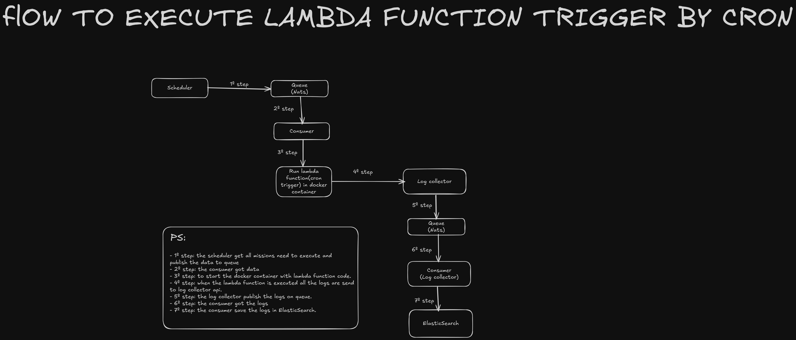

## ABOUT

- The project has focus to create my own faas platform to run the lambda function using golang.

## TECHNOLOGIES

- Golang
- Fiber(Http webserver)
- Cobra(to build CLI)
- Database(Postgreql)
- Nats(queue)
- Cache(redis)
- Elasticsearch(save logs the lambda function executed)
- Docker
- Docker compose

## PROJECT STRUCTURE

```
- cmd
  --- scheduler(the project responsible to trigger the lambda function using cron trigger)
  --- builder(the project responsible to lambda function docker image)
  --- cli(CLI to automate the lambda function deploy )
  --- faas-manager(the project responsible to manage the lambda function)
  --- log-collector(the project responsible to collect the lambda function logs and the lambda function execution logs)
  --- proxy(the project responsible to trigger the lambda function when make the http request)
- internal
  --- scheduler
  ----- configs
  ----- cron
  ----- jobs
  ----- models
  ----- respoitories
  ----- services
  --- builder
  ----- blueprint
  ----- configs
  ----- jobs
  ----- models
  ----- repositories
  --- cli
  ----- commands
  ----- http-client
  ----- types
  --- faas-manager
  ----- configs
  ----- handler
  ----- models
  ----- repositories
  ----- services
  ----- types
  --- log-collector
  ----- configs
  ----- handler
  ----- jobs
  ----- repositories
  ----- types
  --- proxy
  ----- configs
  ----- handler
  ----- jobs
  ----- models
  ----- repositories
  ----- services
- pkg
```

## INSTRUCTIONS TO RUN THE PROJECT

- Clone repository
- Create **.env** file based **.env.example** file.
- Create directory **uploads** in root of directory.
- Execute command **docker-compose up -d** to deploy all applications.
- Execute command **go run cmd/cli/main.go deploy -p path_here** to deploy the lambda function. Example: **go run cmd/cli/main.go deploy -p ./examples/send-request**

## EXTRA DATA

- [Link Insominia with routes](./Insomnia_2024-11-07.json)
- In directory **examples** you can find examples of lambda functions.

## ARCHITECTURE LAMBDA FUNCTION TRIGGER BY HTTP


## ARCHITECTURE LAMBDA FUNCTION TRIGGER BY CRON



## INSTRUCTIONS TO CREATE YOUR OWN LAMBDA FUNCTION

- Create a directory. For example: **hello-world**
- Access directory. For example: **cd hello-world**
- Create **function.go** file. The lambda function needs to have that structure:

```golang
package lambda3

import (
	"os"

	"github.com/gofiber/fiber/v2"
	"go.uber.org/zap"
)

func Handler(c *fiber.Ctx, logger *zap.Logger) error {
  // Your logic code here.
  return c.JSON(fiber.Map{
		"message": os.Getenv("MESSAGE"),
	})
}

```

- Execute command: **go mod init module_name**.
- Execute command **go mod tidy** to download the dependencies.
- Create **config.yml** file in root the directory. The file needs to follow the structure:
  - Cron trigger:
    ```yaml
    name: name_lambda_function
    runtime: golang-cron:1.23 # The another runtimes allowed: golang-cron:1.20, golang-cron:1.19 and golang-cron:1.23
    cpu: 0.5 # Default value is: 1
    memory: 128m # Default value is: 128m
    envs:
      SUBJECT: "Hello, lambda function send_mail_cron."
      MESSAGE: "Hello, lambda function send_mail_cron."
    function:
      path: ./send-mail.go
      trigger:
        cron:
          interval: 1m # PS: the mininum time accepted is 1m(1 minute). Example: 1m(to execute each 1 minute), 5m(to execute each 5 minute), 1h(to execute each 1 hour), 5h(to execute each 5 hours)
    ```
  - Http trigger:
    ```yaml
    name: name_lambda_function
    runtime: golang:1.23 # The another runtimes allowed: golang:1.20, golang:1.19 and golang:1.23
    cpu: 1 # Default value is: 1
    memory: 128m # Default value is: 128m
    envs:
      WEBHOOK_URL: value_env_here
    function:
      path: ./function.go # the lambda function path
      trigger:
        http:
          method: POST # HTTP VERB. OTHER OPTIONS: POST, DELETE, GET and PUT
          path: / # PATH TO TRIGGER THE LAMBDA FUNCTION. THE PATH IS BASED THE PATH FROM FIBER v2
    ```

### ADDIONAL NOTES

- All lambda functions needs these 2 dependencies:
  ```
  "github.com/gofiber/fiber/v2"
  "go.uber.org/zap"
  ```
